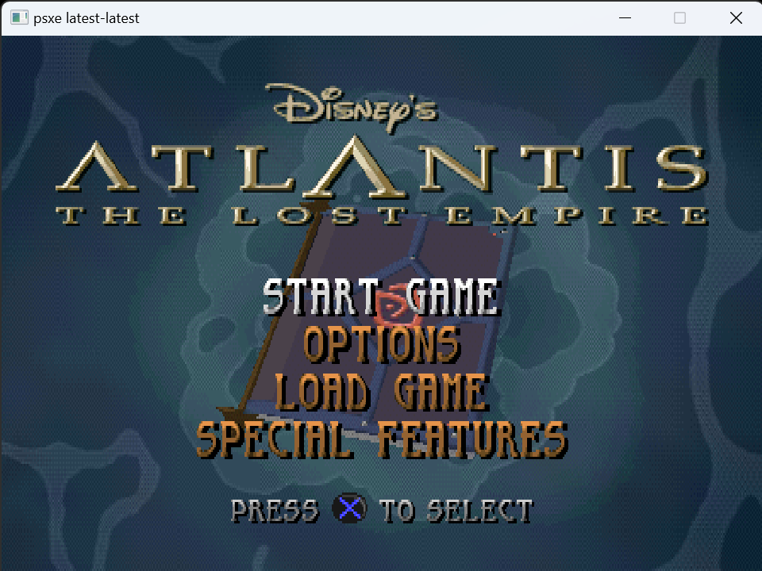
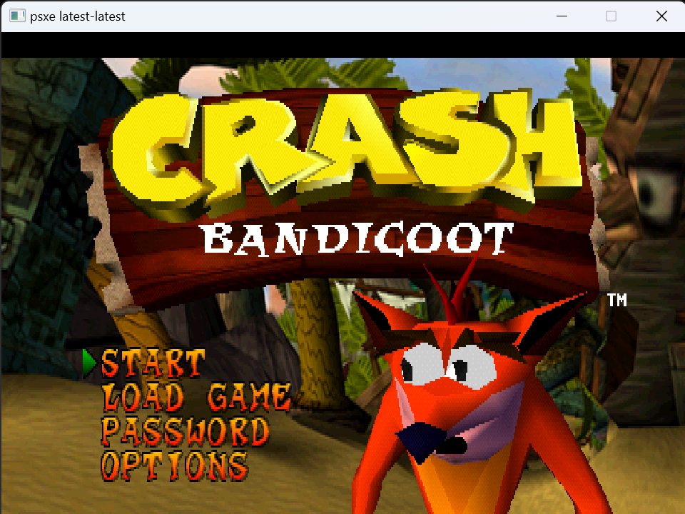
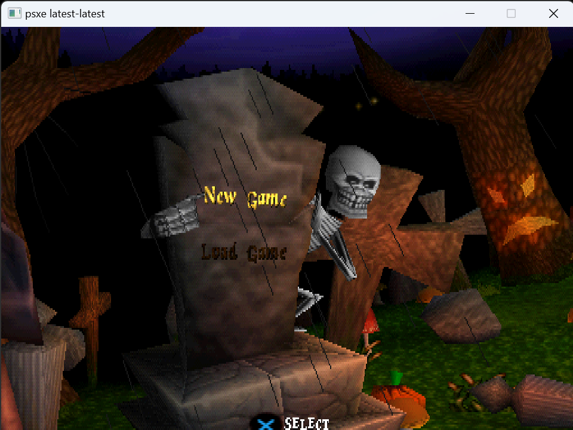

# PSXE
PSXE is a portable and simple PlayStation 1 emulator written in C

## Building
Building can be done by running the following commands

```bash
mkdir build; cd build
cmake .. -DCMAKE_BUILD_TYPE=Release -T ClangCL
cmake --build . --config Release
```

> [!WARNING]
> macOS may run into issues as it is not handled correctly yet

## Progress
- [x] CPU
- [x] DMA
- [x] GPU
- [x] SPU
- [x] MDEC
- [x] GTE
- [x] TMR
- [x] CDR
- [ ] MCD

## Screenshots




## Acknowledgements
This project uses external open source code that can be found on the following GitHub repos
- [argparse.c](https://github.com/cofyc/argparse)
- [log.c (slightly modified)](https://github.com/rxi/log.c)
- [tomlc99](https://github.com/cktan/tomlc99)

Their original licenses are respected and apply to the code in this project

As always, thanks to all original developers for their amazing work